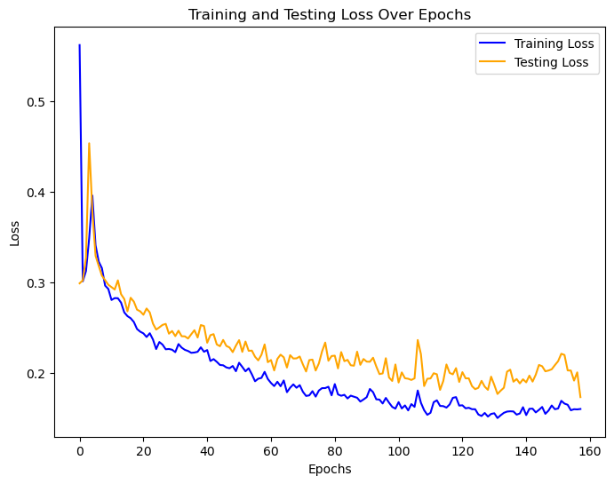
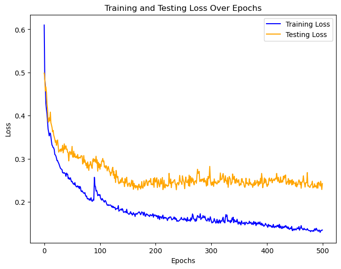

# numpy_neural_network
This repository contains an implementation of a neural network and gradient descent written in numpy. The implementation was trained and evaluated on the MNIST dataset to attain test accuracy of 94.6%. 

The MNIST dataset consists of 70,000 examples of handwritten digits. The handwritten digits are represented by 28x28 pixel grayscale images. For this experiment, 50,00 examples were used for training, 5,000 for validations, and 15,000 for testing.

Several model architectures and hyperparameter choices were explored. However, there were some consistencies: all networks had 3 hidden layers with ReLU, SELU, and tanh activations respectively. The output layer of the model used a softmax optimization. To account for this in gradient descent the softmax activation was added to the loss function and a `DummyActivation` function which just passes the linear transformation from the layer was used as a placeholder.

Five different model architectures (following the constraints above) were tested with the following hidden layer sizes (output layer is always 10 nodes): (784, 784, 784), (1024, 512, 256), (512, 256, 128), (256, 128, 64), (128, 64, 28). Each model architecture was trained and evaluated with the Adam optimizer with the following learning rates 0.01, 0.001, 0.001. Each model was trained for 200 epochs with 100, 500, or 1,000 batch sizes.

The highest performing model according to 01 loss (accuracy) on the validation set had hidden layers of shape (784, 784, 784) and was trained for 157 epochs with batch size 1,000. It attained validation accuracy of 94.8% and test accuracy of 94.6%. Below is the convergence plot for this model (note test loss refers to validation loss in this plot).

Below is another convergence plot example that shows clear over-fitting.

